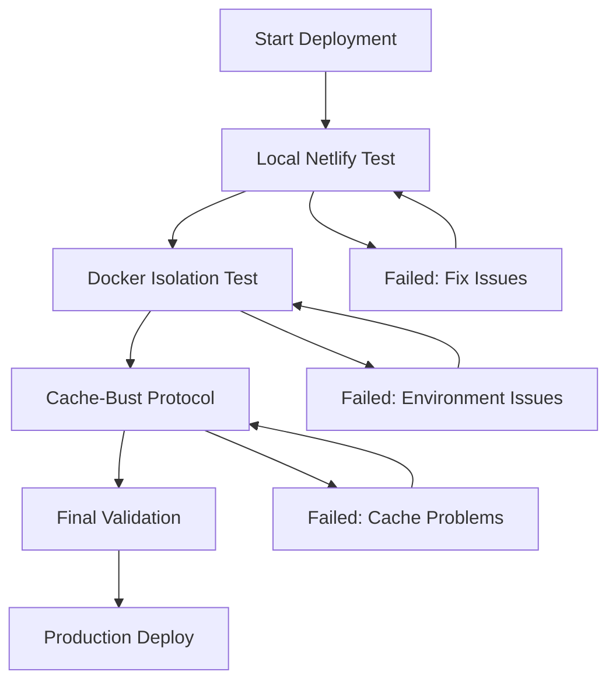

# StartupNamer.org - Advanced Deployment Validation Protocol

## 🚀 Enterprise-Level Deployment Infrastructure

This document outlines the comprehensive deployment validation infrastructure designed to prevent ALL future deployment failures by exactly mirroring Netlify's environment and catching issues locally before they reach production.

---

## 📋 Table of Contents

1. [Overview](#overview)
2. [Architecture](#architecture)
3. [Components](#components)
4. [Usage Guide](#usage-guide)
5. [Troubleshooting](#troubleshooting)
6. [Maintenance](#maintenance)

---

## Overview

### Mission Statement
Create enterprise-level deployment validation infrastructure that exactly mirrors Netlify's environment to prevent future build failures through comprehensive local testing, cache-busting protocols, and Docker-based isolation.

### Key Features
- **Exact Netlify Environment Mirror**: Node.js 18.19.1, npm 10.2.4
- **Comprehensive Pre-deployment Validation**: Multi-phase testing protocol
- **Systematic Cache-Busting**: Nuclear cache clearing with metadata tracking
- **Docker-based Isolation**: Complete environment isolation for testing
- **Enterprise Reliability**: Automated validation with detailed reporting

---

## Architecture

### Infrastructure Components

```
StartupNamer.org Deployment Validation Infrastructure
├── .devcontainer/
│   ├── devcontainer.json          # VSCode dev environment
│   └── setup.sh                   # Environment setup script
├── scripts/
│   ├── test-netlify-build.sh      # Local Netlify testing
│   ├── cache-bust-deploy.sh       # Cache-busting protocol
│   └── test-isolated-build.sh     # Docker isolation testing
├── docker-compose.yml             # Multi-service testing environment
├── docker/
│   └── nginx.conf                 # Production simulation config
└── package.json                   # Enhanced deployment scripts
```

### Validation Flow



---

## Components

### 1. DevContainer Environment

**File**: `.devcontainer/devcontainer.json`

Provides exact Netlify environment replication with:
- Node.js 18.19.1 (exact Netlify version)
- npm 10.2.4 (exact Netlify version)
- All required VSCode extensions
- Automatic environment setup
- Volume mounts for performance
- Port forwarding for development

**Usage**:
```bash
# Open in VSCode with Dev Containers extension
# Automatic setup via .devcontainer/setup.sh
```

### 2. Local Netlify Testing

**File**: `scripts/test-netlify-build.sh`

Mirrors Netlify's exact build environment and process:
- Exact environment variable replication
- Cache clearing (mirrors Netlify behavior)
- Build process validation
- Artifact verification
- Performance analysis
- Comprehensive reporting

**Usage**:
```bash
npm run test:netlify
```

**Features**:
- ✅ Environment validation
- ✅ Dependency installation with exact Netlify flags
- ✅ Build process testing
- ✅ Artifact verification
- ✅ Size analysis
- ✅ Serving capability testing

### 3. Cache-Busting Deployment Protocol

**File**: `scripts/cache-bust-deploy.sh`

Systematic cache-busting for problematic builds:
- Nuclear cache clearing (npm, node_modules, build artifacts)
- Version bumping with cache-bust metadata
- Fresh dependency resolution
- Build verification
- Automated git commits with metadata
- Backup branch creation

**Usage**:
```bash
npm run cache:bust
```

**Phases**:
1. **Nuclear Cache Clearing**: Remove all caches and artifacts
2. **Version Bumping**: Update versions with cache-bust identifiers
3. **Environment Reset**: Clean environment variables
4. **Fresh Installation**: Complete dependency reinstallation
5. **Build Verification**: Comprehensive build testing
6. **Metadata Generation**: Deployment manifest creation
7. **Git Commit**: Automated commit with cache-bust metadata
8. **Final Validation**: Complete artifact verification

### 4. Docker Isolation Testing

**Files**: `docker-compose.yml`, `scripts/test-isolated-build.sh`

Complete deployment environment testing with Docker isolation:
- **Netlify Mirror Service**: Exact environment replication
- **Build Tester Service**: Automated validation
- **Static Server**: Production simulation with nginx
- **Performance Monitor**: Lighthouse testing

**Usage**:
```bash
npm run deploy:test
```

**Services**:
- `netlify-mirror`: Exact Netlify environment
- `build-tester`: Automated testing service
- `static-server`: Production simulation
- `performance-monitor`: Lighthouse auditing

---

## Usage Guide

### Quick Start

1. **Full Validation Pipeline**:
```bash
npm run deployment:full-validation
```

2. **Individual Components**:
```bash
# Test local Netlify build
npm run test:netlify

# Run Docker isolation test
npm run deploy:test

# Execute cache-bust protocol
npm run cache:bust

# Safe deployment (with validation)
npm run deploy:safe
```

### Development Workflow

1. **Setup Development Environment**:
```bash
# Using DevContainer (recommended)
# Open in VSCode with Dev Containers extension

# Or manual setup
npm run env:setup
```

2. **Pre-deployment Testing**:
```bash
# Validate build locally
npm run test:netlify

# Test in isolated environment
npm run deploy:test
```

3. **Deployment with Cache-Busting**:
```bash
# If issues detected, run cache-bust protocol
npm run cache:bust

# Safe deployment with validation
npm run deploy:safe
```

### Docker Environment Management

```bash
# Start Docker environment
npm run docker:up

# View logs
npm run docker:logs

# Stop environment
npm run docker:down

# Complete cleanup
npm run docker:clean
```

---

## Troubleshooting

### Common Issues

#### Build Fails in Local Testing
```bash
# Check environment
node --version  # Should be v18.19.1
npm --version   # Should be 10.2.4

# Clear caches and retry
npm run cache:bust
```

#### Docker Issues
```bash
# Verify Docker is running
docker info

# Clean up and restart
npm run docker:clean
npm run docker:up
```

#### Version Mismatches
```bash
# Verify Netlify environment variables
cat netlify.toml | grep VERSION

# Update devcontainer if needed
# Edit .devcontainer/devcontainer.json
```

### Diagnostic Commands

```bash
# Environment information
cat .devcontainer/environment-info.json

# View test results
ls -la test-results/

# Check Lighthouse reports
ls -la lighthouse-reports/

# Docker service status
docker-compose ps
```

---

## Maintenance

### Regular Tasks

1. **Update Dependencies**:
```bash
# Update Netlify CLI
npm install -g netlify-cli@latest

# Update Docker images
docker-compose pull
```

2. **Clean Up Old Artifacts**:
```bash
# Clean test results
rm -rf test-results/old-*

# Clean Lighthouse reports
rm -rf lighthouse-reports/old-*

# Clean Docker volumes
npm run docker:clean
```

3. **Verify Environment Compatibility**:
```bash
# Check Netlify environment changes
netlify status

# Update versions if needed
# Edit netlify.toml and .devcontainer/devcontainer.json
```

### Monitoring

- **Build Success Rate**: Monitor via deployment manifests
- **Performance Metrics**: Review Lighthouse reports
- **Environment Drift**: Compare local vs Netlify versions

---

## Advanced Features

### Automated Validation Pipeline

The deployment validation protocol includes several automated validation levels:

1. **Level 1 - Local Testing**: Basic build validation
2. **Level 2 - Environment Testing**: Docker isolation
3. **Level 3 - Cache Busting**: Nuclear cache clearing
4. **Level 4 - Performance Testing**: Lighthouse auditing

### Metadata Tracking

All deployment actions are tracked with comprehensive metadata:
- **Cache-Bust ID**: Unique identifier for cache-bust deployments
- **Build Timestamps**: Detailed timing information
- **Environment Snapshots**: Complete environment state capture
- **Git Integration**: Automatic commit generation with metadata

### Rollback Capabilities

Built-in rollback mechanisms for failed deployments:
- **Backup Branches**: Automatic branch creation before changes
- **State Restoration**: Complete environment state restoration
- **Artifact Recovery**: Build artifact backup and recovery

---

## Security Considerations

- **Environment Isolation**: Docker provides complete isolation
- **No Secrets in Logs**: Sensitive information is filtered
- **Secure Defaults**: All scripts use secure bash settings
- **Permission Management**: Proper file permissions enforced

---

## Performance Optimization

- **Volume Mounts**: Docker volumes for improved I/O performance
- **Parallel Processing**: Multi-service Docker composition
- **Cache Optimization**: Strategic cache management
- **Resource Limits**: Proper resource allocation

---

## Integration

### CI/CD Integration
```yaml
# GitHub Actions example
- name: Deployment Validation
  run: |
    npm run deployment:full-validation
    npm run deploy:production
```

### Netlify Integration
```toml
# netlify.toml
[build]
  command = "npm run test:netlify && npm run build"
```

---

## Support

For issues or questions regarding the deployment validation infrastructure:

1. **Check Logs**: Review detailed logs in `test-results/`
2. **Run Diagnostics**: Use built-in diagnostic commands
3. **Environment Reset**: Use cache-bust protocol for environment issues
4. **Docker Reset**: Clean and rebuild Docker environment

---

## Changelog

### v2.0.0 - Enterprise Deployment Infrastructure
- Complete Netlify environment mirroring
- Docker-based isolation testing
- Advanced cache-busting protocol
- Comprehensive validation pipeline
- Enterprise-level reliability features

---

## License

This deployment validation infrastructure is part of the StartupNamer.org project and follows the project's licensing terms.

---

*This documentation is maintained as part of the StartupNamer.org deployment validation protocol. Last updated: $(date -Iseconds)*